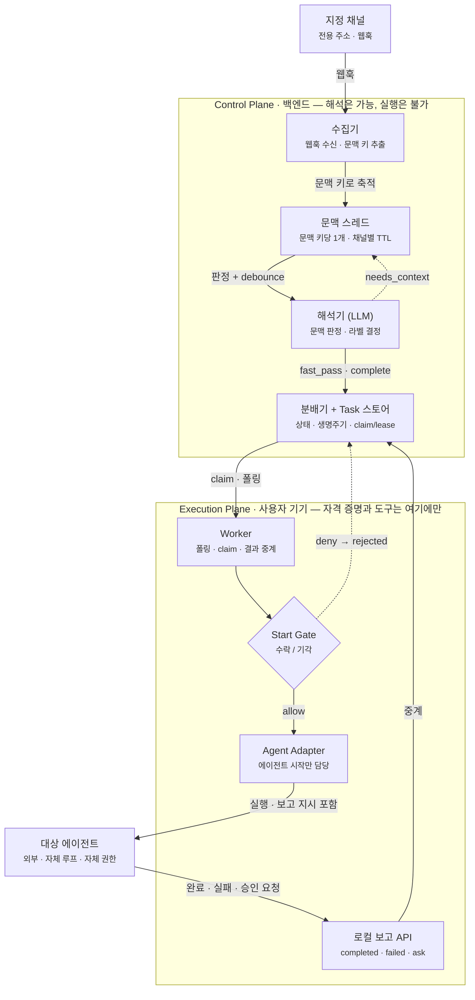
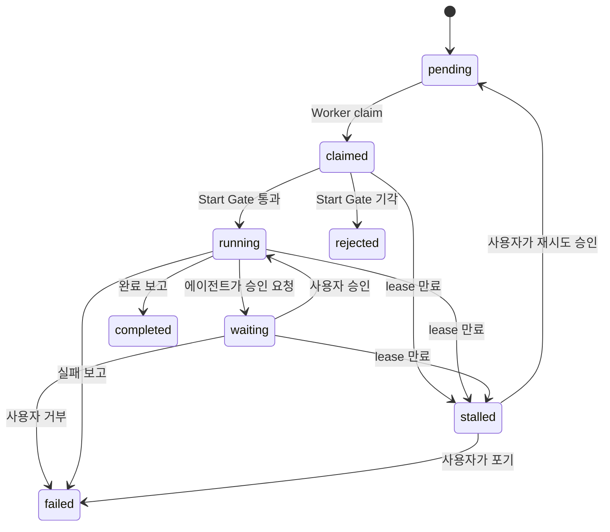

# samdi

현실 세계의 이벤트를 범용 AI 에이전트에게 전달하는 오케스트레이션 레이어.

메일 한 통, 이슈 하나, 웹훅 하나가 도착했을 때 그걸 에이전트에게 시킬 작업으로 만들어 배달하고,
시작을 통제하고, 결과를 받아 기록한다. **에이전트에게는 실행 권한을 주지 않는다** —
자격 증명과 도구는 사용자 기기에만 있고, 서버는 이벤트를 읽고 해석할 수 있어도 실행할 수는 없다.

> 상태: 실험 단계. 오케스트레이션 골격(Task 생명주기·claim/lease·승인 흐름)과
> Claude Code 연동이 동작한다. 서버 해석 파이프라인은 진행 중이다 ([로드맵](#로드맵)).

## 이게 뭘 해결하나

에이전트에게 실제 일을 맡기려면 두 가지가 필요하다. 현실의 사건이 에이전트에게 **닿아야** 하고,
그 에이전트가 **뭘 할 수 있는지 통제**돼야 한다. samdi는 그 사이에 들어간다.

- **이 프로젝트는 에이전트 런타임이 아니다.** 에이전트 루프를 소유하지 않는다.
  작업을 배달하고 시작시키고 보고를 받는 것까지가 범위이며, 판단과 실행은 에이전트 자신의 것이다.
- **신뢰 경계는 사용자 기기다.** 원격 에이전트는 제안하고, 로컬 게이트가 판정하고, 로컬 도구가 실행한다.
- **에이전트는 갈아끼울 수 있다.** 범용 실행 규약 + 어댑터. 첫 레퍼런스 구현은 Claude Code.

## 아키텍처



이벤트와 Task는 1:1이 아니다. 웹훅은 **문맥 스레드**에 쌓이고, 해석기가 이벤트마다
`fast_pass`(자기완결적 단순 요청 — 즉시 배달) / `needs_context`(더 기다림) /
`complete`(문맥 완성) / `noise`(폐기)를 판정한다. 해석·분류 LLM은 서버에서 한 번만 돈다 —
Worker마다 claim할 때마다 LLM을 돌리는 건 낭비이기 때문이다.

> 위 그림에서 **문맥 스레드와 해석기는 아직 구현 중**이다. 현재는 이벤트가 곧바로 Task가 되므로
> 실질적으로 `fast_pass` 전용 경로만 동작한다. 그 아래(claim부터 보고까지)는 모두 동작한다.

### Task 생명주기



**lease가 만료돼도 자동으로 재배포하지 않는다.** 작업 내용이 자연어이고 에이전트가 비결정적이라
"이미 메일이 나갔는지"를 시스템이 알 수 없다. 그래서 `stalled`로 세워두고 사람이 재시도를 승인한다 —
재시도도 일종의 시작이므로 Start Gate 철학과 같다.

## 빨리 돌려보기

Node.js 22+ / pnpm이 필요하다. 설정 파일 없이 데모 기본값으로 돈다.

```sh
pnpm install
```

터미널 세 개로:

```sh
# 1) Control Plane (:3000)
pnpm --filter @samdi/control-plane start

# 2) Worker — 로컬 보고 API + UI용 API (:4700)
pnpm --filter @samdi/worker start

# 3) Worker UI (http://localhost:5173)
pnpm --filter @samdi/worker-ui dev
```

브라우저에서 <http://localhost:5173> 을 열고 **이벤트 주입**에 아무 내용이나 넣으면,
Task가 만들어져 claim → Start Gate → mock 에이전트 → 완료까지 흐르는 걸 볼 수 있다.
Task를 클릭하면 본문과 감사 이벤트 타임라인이 보인다.

- 내용에 **"승인"** 을 넣으면 mock 에이전트가 승인을 요청한다 → 목록 행에 승인/거부 버튼이 뜬다.
- 주입 폼의 드롭다운에서 **에이전트를 고를 수 있다**(`mock` / `claude-code` / `claude-code-terminal`).

CLI로도 같은 조작이 된다:

```sh
cd apps/demo-cli
pnpm start inject "내일 오전 회의 일정 잡아줘"
pnpm start list
pnpm start show <taskId>      # 본문 + 감사 이벤트
pnpm start retry <taskId>     # stalled 재시도 / abandon 으로 포기
```

### 실제 에이전트(Claude Code)로 돌리기

[Claude Code](https://claude.com/claude-code)가 설치돼 있으면 어댑터를 바꾸기만 하면 된다:

```sh
SAMDI_AGENT=claude-code pnpm --filter @samdi/worker start
```

Worker가 headless로 Claude Code를 실행하고, 의뢰 프롬프트에 **보고 규약**(완료·실패·승인 요청을
로컬 보고 API로 보내는 방법)을 함께 넣는다. 에이전트가 보고를 잊고 종료하면 어댑터가 종료 코드를 보고 대신 보고한다.

`claude-code-terminal`을 고르면 백그라운드가 아니라 **Terminal 창이 열려** 에이전트가 일하는 과정을
직접 보고 개입할 수 있다(macOS).

실행 정책은 Claude Code 자신의 권한 체계에 맡긴다 — `allowedTools`/`permissionMode`로 조정한다.
기본값은 보고용 `Bash(curl *)`만 허용하므로, 파일을 만들거나 명령을 실행하게 하려면 열어줘야 한다
([설정 문서](docs/configuration.md#에이전트가-실제로-파일을-만들고-명령을-실행하게-한다)).

## 설정

YAML + zod 검증. **설정 파일은 없어도 되고**, 환경변수가 파일을 덮는다.

```sh
cp samdi.server.example.yaml samdi.server.yaml   # Control Plane
cp samdi.worker.example.yaml samdi.worker.yaml   # Worker
```

전체 키·환경변수 매핑·작업 레시피는 **[docs/configuration.md](docs/configuration.md)** 에 있다.
사람과 코딩 에이전트가 같은 문서로 설정을 바꿀 수 있게 쓰였다.

## 구조

```
apps/
  control-plane/   이벤트 수집 + Task 상태/생명주기 API (해석 파이프라인 예정)
  worker/          claim → Start Gate → 어댑터 → 보고 중계 (+ UI용 로컬 API)
  worker-ui/       사용자 기기 대시보드 (React + Vite)
  demo-cli/        end-to-end 조작용 CLI

packages/
  config/          YAML 설정 스키마·로더 (env > 파일 > 기본값)
  protocol/        공유 스키마: Task, 상태 머신, API 계약, 보고/판정 타입
  task-domain/     상태 전이 규칙, 본문 저장소 인터페이스
  triage/          1차 판단 (서버 해석기로 이동 예정 — 로드맵 참조)
  agent-adapter/   에이전트 실행 규약 + 어댑터 (mock, Claude Code)
  policy-gateway/  Start Gate + allow/deny/ask 판정
  tool-sdk/        에이전트에게 붙여줄 MCP 도구 (예정)
```

브라우저는 Worker의 로컬 API만 본다. Control Plane 접근은 Worker가 자기 키로 프록시하므로
UI에 키가 노출되지 않고, 승인·재시도 같은 사용자 결정은 사용자 기기에서 내려진다.

## 개발

```sh
pnpm typecheck
pnpm test
pnpm lint
```

TypeScript / Node 22+ / pnpm workspace / Fastify / SQLite(better-sqlite3) / zod / Vitest.

## 로드맵

Task 생명주기·claim/lease·승인 흐름·Claude Code 연동은 동작한다.
서버 해석 파이프라인, 배포(Docker·Helm), 실제 채널 연동이 다음 순서다.

전체 목록: **[docs/roadmap.md](docs/roadmap.md)**

## 라이선스

[MIT](LICENSE)
